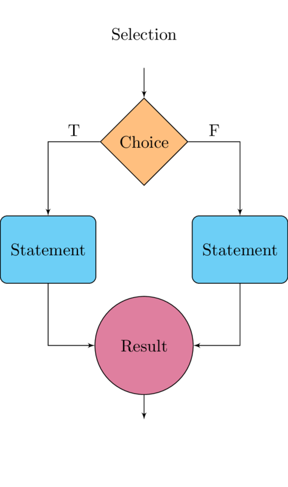

```{r setup, include=FALSE}
library("knitr")
knitr::opts_chunk$set(echo = FALSE)
```

## On the Agenda

- Effective Groups (Inspired by [Prof. Brian Bailey](https://cs.illinois.edu/directory/profile/bpbailey))
    - Why groups?
    - Stages of Group Development
    - Group Norms
- Control Structures
    - `if/else`, `if/elseif/else`, `switch`
    - Ternary Operator
    - While
    - Do-While
    - For
- Big O
    - Notation
    - Examples
    - Drawbacks

## Grouping Brainstorming

Form a group of 2-3 people around you.

Take three minutes to answer the following:

- What was your *best* group experience?
- What do you like the most about group work?
- What techniques worked well for groups?

Take (another) three minutes to answer the following:

- What was your *wurst* group experience?
- What do you *dislike* the most about group work?

## Did you introduce yourself?

- When you started to talk with those around you, did you **introduce** yourself first? 
- Or did you just jump into the task?
- **Always introduce yourself *before* starting the task!**

## Why Group?

- Exposure to *new* viewpoints from different fields and life experiences
- Improves creativity and overall work quality (4 eyes vs. 2 eyes)
- Constructive dialog and increased internal group motivation
- Personal accountability to the team
- Friendship
- Prepares you for a team-environment in the workplace or a research group.

## Statistics **is** a group effort


## Stages of Group Development [@2010tuckmangroup]


## Forming (Honeymoon Stage)

- **Excitement**
    - New experiences and people
- **Eagerness**
    - Working on a common new task
- **High Expectations**
    - We will be able to get a good grade.
    - We can use *this*
- **Anxiety**
    - Will I fit in?
    - Am I able to contribute?
    
## Forming (Honeymoon Stage)

Combat the **anxiety** with an ice-breaker activity:

- Try to come up with a team name
- Talk about the weather
- Fact or Fiction 
    - Write 2 facts and 1 fictional item
    - The group guesses the fictional item.

## Storming (Internal Strife)

- As you begin to work, group structure will form to ensure goals are met
    - Who is the leader? Who can write well? Who is able to program? And so on...

- Watch out for **conflict** due to group structure disagreements on roles and processes.
     - Form a consensus on different roles and processes.
     
- Some groups may skip this stage and jump to **norming**.
     
## Norming (Resolution)

- Conflicts in **Storming** are resolved due to a formed consensus. 
      - Team member idiosyncrasy are accepted or corrected.
- Team members begins focusing on the goal as group members take on their responsibilities.
- Overall, the team is ready to collaborate together toward a common goal.
      - Watch out for suppressing conflict by avoiding discussing controversial ideas!

## Performing (Working)

- Team members work fluidly together to finish the common goals.
- Main stage of the group process
- Teams may stumble back to prior stages or never reach this stage.

## Adjourning / Mourning (Finale)

- Completion of the common task and the end of the group
    - Anxiousness, Sadness, or Relief
- Reflect on how the group worked and channel it into the next group
- Congratulate team members on a job well down and note the individual contributions
- Finish any other administrative tasks
    - e.g. Write a peer review of each group member.
    
## Tips for Group Work - Part 1

- **Work Hard**
    - Do your share and more to set both an example and communicate willingness
- **Include All Team Members in Group Activities**
    - Being left out *stinks* and its hard to get over.
    - Try to provide reasonable deadlines for time sensitive decisions.
- **Take Turns**
    - Cycle leadership, following, organization, note taker, and discussant roles.
    - Promotes an atmosphere of shared equity.


## Tips for Group Work - Part 2

- **Constructive Dialog**
    - Focus on the **idea** and **not** the person proposing it.
    - Try to **extend**, **shape**, or **add** to a proposed idea
- **Data Driven Decisions**
    - Avoid "I don't like it" in favor of evidence.
    - Personal preferences are not evidence and are hard to articulate.
- **Focus on the Task**
    - Utilize your time appropriately by being prepared and ontime.

## Tips for Group Work - Part 3

- **A Happy Group Makes for Happy Group Members**
    - Make a positive statement in the beginning
    - Bring something to the meeting (e.g. food, drinks, et cetera)
- **Move On**
    - Don't sweat not being able to agree
    - Take breaks and revisit the idea later.
- **Avoid Assigning Blame**
    - Suggest ideas to fix problems
    - Try to understand the other persons viewpoint
- **Deliverables**
    - Figure out **who** is doing **what** task and **when** it will be done.

## Tools for Collaboration

- **Create a shared space to store all your materials**
    - [CITES Wiki](https://wiki.cites.illinois.edu/wiki/)
    - [Dropbox](www.dropbox.com) (2.5 gigs), [BoxSync](https://app.box.com/) (50 gigs), & [Google Drive](https://drive.google.com) (Unlimited Storage!!!)
- **Group Document Editing**
    - [Google Docs](https://docs.google.com)
    - [ShareLaTeX](www.sharelatex.com) (1 Collaborator + Supports Knitr)
    - [Overleaf](https://www.overleaf.com/) (1 gig + unlimited collaborators)
    - MS Word's [Track Document Changes](https://support.office.com/en-us/article/Track-changes-while-you-edit-024158a3-7e62-4f05-8bb7-dc3ecf0295c4)
- **Use a discussion board**
    - [Google Groups](https://groups.google.com/forum/#!overview)
    - [Illinois Mailing Lists](http://www.cites.illinois.edu/maillist/)
- **Use a Versioning Tool**
    - [git](http://git-scm.com/downloads)
    - [svn](https://subversion.apache.org/packages.html)
- **Remote Communications Tools**
    - [Skype](http://www.skype.com/en/download-skype/skype-for-computer/)
    - [Google Hangouts](https://www.google.com/hangouts)
    
## One Last Secret

**Groups that do well tend to sit together in class.**

```{r, out.width = "150px", fig.retina = NULL, fig.align='center', echo = F, cache = T}
knitr::include_graphics("figures/smiley_face.png")
```

## Summary of Group Work

- In the industry and academia, working in groups is the standard.
    - **Avoid being a lone wolf**
- Provided tips and tricks to working in a group
- Emphasized **tool** usage.

## Coming up next... 

Next on the agenda is talking about **Control Structures** in *R*.

## Control Structures and Flow of Control

- A **control structure** is a piece of code whose **analysis of a variable** results in a **choice being made as to the direction** the program should go.

- Meanwhile, the **Flow of Control** specifies the **direction** the program takes or **flows** when given conditions and parameters.

## Types of Control Structures:

There are **three** different types of control structures. 

- **Sequential:** Executes code statements one line after another
     - Exactly adhering to an algorithm like creating a cake from a recipe.
- **Selection:** Allows for decisions between 2 or more alternative paths. 
     - Making a choice as to whether I want a [Cold Brew](http://lp.starbucks.com/coldbrew) or [Iced Coffee](http://www.starbucks.com/menu/drinks/iced-coffee/iced-coffee) from *Starbucks*.
- **Iteration:** Enables the looping or repeating of a section code multiple times.
     - Saying the same words [over and over again](https://www.youtube.com/watch?v=NP0mQeLWCCo).

## Logical Operators

To control the structure, we sometimes must make **decisions** that have different cases based on a *boolean* (0 or 1) expression.

A few such structures are given as:

```{r logical_ops, echo = F, cache = T}
d = data.frame(Operator = c("`x == y`","`x != y`","`x < y`", "`x > y`", "`x <= y`", "`x >= y`","`!x`","`x || y`","`x && y`"),
               Explanation = c("`x` equal to `y`", "`x` not equal to `y`",
                                "`x` less than `y`","`x` greater than `y`",
                               "`x` less than or equal to `y`","`x` greater than or equal to `y`",
                                "not `x`",
                               "`x` or `y`","`x` and `y`"),
               Example = c( "` 1 == 10`", "`1 != 10`","`1 < 10`", "`1 > 10`","`1 <= 10`","`1 >= 10`","`!(1 < 10)`","`FALSE || TRUE`","`(1 < 10) && (15 > 10)`"),
               Result = c("`FALSE`","`TRUE`","`TRUE`","`FALSE`","`TRUE`","`FALSE`","`FALSE`","`TRUE`","`TRUE`"))

knitr::kable(d[1:6,1:2])
```

## Combining Logical Operators

We can combine logical operators using:


```{r logical_ops_combine, echo = F, cache = T, dependson="logical_ops"}
knitr::kable(d[7:9,1:2], row.names = F)
```


## Examples of Logical Operators

```{r logical_ops_example, echo = F, cache = T, dependson="logical_ops"}
knitr::kable(d[,2:4])
```

## Venn Diagrams of Logic


```{r venn_diagram_x_v2, out.width = "100px", fig.retina = NULL, fig.align='center', echo = F, cache = T}
knitr::include_graphics("figures/venn_diagram_x_v2.png")
```


```{r venn_diagram_notx_v2, out.width = "100px", fig.retina = NULL, fig.align='center', echo = F, cache = T}
knitr::include_graphics("figures/venn_diagram_notx_v2.png")
```


## Venn Diagrams of Logic


```{r venn_diagram_xandy, out.width = "100px", fig.retina = NULL, fig.align='center', echo = F, cache = T}
knitr::include_graphics("figures/venn_diagram_xandy.png")
```


```{r venn_diagram_xory, out.width = "100px", fig.retina = NULL, fig.align='center', echo = F, cache = T}
knitr::include_graphics("figures/venn_diagram_xory.png")
```

## Short Circuit Evaluation

- The `&&` and `||` operators both have a feature called **short-circuit evaluation**.
- Consider the `&&` (`AND`) expression (`x && y`) ...
     - If `x` is `FALSE`, then there is no reason to evaluate `y` so the evaluation stops.
     - Take for example a division check for zero:
```{r, eval = F, echo = T}
x = 0; y = 4         # Define Variables
(x != 0 &&  y/x > 0) # Evaluates only x != 0
                     # so y/x never runs.
```
- Similarly, the `||` (`OR`) expression (`x || y`) ... 
      - If `x` is `TRUE`, then whole expression is `TRUE` so there is no need to evaluate `y`.
      - Only in the case when `x` is `FALSE` does `y` get evaluated.

## Sequential Control

Sequential control is the default operating behavior of a computer program. The program will read each line one after another and execute it.


```{r sequential_diagram, out.width = "100px", fig.retina = NULL, fig.align='center', echo = F, cache = T}

```

## Selection Control

- **Selection:** Allows for decisions between 2 or more alternative paths. 
     - `if`
     - `if/else`
     - `if/elseif/else`
     - `switch`
     
```{r selection_diagram, out.width = "100px", fig.retina = NULL, fig.align='center', echo = F, cache = T}

```
     
## Selection Control - `if` and `if/else`

The `if` statement provides the ability to execute code only when the `expression` is `TRUE` like so:

```{r, eval = F, echo = T}
if (expression){ # True Case
  # statement
}
```

Traditionally, one would normally use `if/else` statement to address both `TRUE` and `FALSE` cases:

```{r, eval = F, echo = T}
if (expression){ # True Case
  # statement
} else {         # False Case
  # statement
}
```

## Selection Control - `if` and `if/else` Examples

Selection control in action:

```{r, echo = T}
x = 2
if (x > 0){   # Detect if x is a positive number
  cat(x,"\n") # Print `x` to console 
}
```

```{r, echo = T, engine='R'}
if (x != 42){    # True Case
  cat("This is not the meaning of life\n") 
  x = 42
} else {         # False Case
  cat("This is the meaning of life!\n") 
}
```


## Selection Control - `if` and `if/else` Example

Consider the following `if/else` statement, how will the program operator?

```{r, eval = F, echo = T, engine='R'}
if (x < 1)
  cat("True\n")
else
  cat("False\n")
  cat("Too bad!\n");
```

## Selection Control - `if` and `if/else` Common Mistakes

A few other problematic areas when working with `expressions` for `if` statements in R:

**Example 1:**
```{r, eval = F, echo = T, engine='R'}
user_input = readline(prompt="Enter y or n:")
if (user_input != "y" || user_input != "n")
  cat("Please enter either y or n (y for yes and n for no)\n")
```

**Example 2:**
```{r, eval = F, echo = T, engine='R'}
x = 9; y = 20
if (x < 10) && (y < 35)
  cat("Bingo was his name!\n")
```

**Example 3:**
```{r, eval = F, echo = T, engine='R'}
x = 43
if (x == 42 || 43 || 44)
  cat("That's close to my age!\n")
```

## Selection Control - `if` and `if/else` Common Mistakes

**Example 4:**
```{r, eval = F, echo = T, engine='R'}
x = seq(0,1,by = 0.1)
y = seq(.1,1.1,by = 0.1)
if (x < y)
  TRUE
```

## Selection Control - Vectorized `if/else` 

In the case of the last `if` statement, we have the ability to use *R*'s vectorized `ifelse()`
```{r, eval = F, echo = T, engine='R'}
ifelse(expression, TRUE-CONDITION, FALSE-CONDITION)
```

Example:
```{r, echo = T, engine='R', cache = T}
x = seq(0,1,by = 0.1)
y = seq(0.1,1.1,by = 0.1)
ifelse(x < y, TRUE, FALSE)
```

**Note:** Watch out for vector recycling!

## Selection Control - `if/elseif/else` 

Sometimes, we may wish to group together certain conditions

```{r, eval = F, echo = T, engine='R'}
if(expression){
    # statements
} else if (expression2){
    # statements
} else { 
    # statements
}
```

In this case, the first statement is checked, if it does not contain the correct value the next statement is check and so until either one of the `expression`s is true or it arrives at the `else` condition.

## Selection Control - `if/elseif/else` 

**Example:**
```{r, echo = T, cache = T}
x = 3
if (x ==1) {
  cat('Equal\n')
} else if (x > 1){
  cat('Greater Than\n')
} else {
  cat('Less Than\n')
}
```

## Selection Control - `if/elseif/else` 

An equivalent, though, less desirable statement could be written using only `if/else`

```{r, echo = T, cache = T}
x = 3
if (x == 42) {
  cat('Equal\n')
} else {
  if (x > 42){
    cat('Greater Than\n')
  } else {
    cat('Less Than\n')
  }
}
```

**Discussion:** Why might structuring the `if` this way be not so ideal?


## Selection Control - Vectorized `if/elseif/else` 

Following in the previous examples footsteps, we can write a vectorized version to process multiple observations via:

```{r, echo = T, cache = T}
ifelse(x == 42, 'Equal', 
       ifelse(x > 42, 'Greater Than', 'Less Than'))
```

## Selection - Ternary Operator

Previously, we saw a *vectorized* version of the ternary operator given by `ifelse()`.

What makes a selection statement a **ternary operator** is it is meant to be an **inline** `if/else` statement. e.g.

```{r, eval = F, echo  =T}
if(expression) TRUE  else  FALSE
```

Consider:

```{r, eval = F, echo  =T}
x = 42
a = if(x == 42) TRUE else FALSE # Verbose
a = (x == 42)                   # Concise
```

## Selection Control - `switch` 

Within a `switch`, the expression is evaluated as the first parameter and then compared against the values in the case labels. 

```{r, eval = F, echo = T}
switch(type,
       case_1 = statement_1,
       case_2 = statement_2,
       statement_3 # Default / Else 
)
```

Switch are often represented as `if/elseif/else` like:

```{r, eval = F, echo = T}
if (type == case_1){
  # statement 1
} else if (type == case_2){ 
  # statement 2
} else{
  # statement 3
}
```

## Selection Control - `switch` Example

There are multiple ways to switch in R. Principally, switches either respond to **index** or **named expression**.

**Index:**
```{r, echo = T}
switch(1, 
       "First",
       "Second")
```

**Named Expression:**
```{r,  echo = T}
switch("toad", 
       prince = "First", 
       toad = "Second", 
       "Third")
```

**Note:** Faster to use a `switch` than an `if/elseif/else` in *R*!

## Selection Control - `switch` Example

Consider the following switch:

```{r, eval = F, echo = T}
switch(2, 
       prince = "First", 
       toad = "Second", 
       "Third")
```

- What will be the output? 

## Selection Control - `switch` Example

Let's make a modification to the previous switch to use an index, e.g.

```{r, eval = F, echo = T}
switch(4,               ## Switched to Numeric
       prince = "First", 
       toad = "Second", 
       "Third")
```

What will be the output? 

## Selection Control - `switch` Example

- What happens when we change to use a named expression?

```{r,  eval = F, echo = T}
switch("Fourth",           ## Switched to Named
       prince = "First", 
       toad = "Second", 
       "Third")
```

- How does this jive with the previous `switch` example?


## Iteration Control

- **Iteration:** Enables the looping or repeating of a section code multiple times.
     - `for`
     - `while`
     - `do/while`

## Iteration Control

> "I choose a lazy person to do a hard job. Because a lazy person will find an easy way to do it."
>
> --- Bill Gates

Iteration is the advent of the ability to repeat statements like:

```{r echo = T, eval = F}
cat("Hello World!\n")
cat("Hello World!\n")
cat("Hello World!\n")
```

Without having to type it!

## Iteration Control - `for`

The simplistic loop within *R* is that of the `for` loop. 

```{r, echo = T, eval = F}
summed = 0             # Output Variable
for (i in 1:5) {       # Iteration Sequence
  summed = summed + i  # Statement
}
```

## Iteration Control - `for`

The `for` loop provides the ability to **automatically** increment the counting variable or iterate through a set of named expressions.

```{r, echo = T, eval = F}
x = c("coffee","doppio espresso", 
      "iced coffee", "cold brew")

for (i in x) {
  cat(x[i],"\n")
}

for (i in 1:4) {
  cat(x[i],"\n")
}
```


## Iteration Control - Index Examples

Consider the loop of:

```{r, echo = T, eval = F}
a = numeric(0)
for(i in 1:length(a)){
  cat("Hello!\n")
}
```

What should be the output?


## Iteration Control - Index Protection

Instead of using `1:length(a)` to iterate a loop counter, try to use: `seq_len(length(a))` or `seq_along(a)`

```{r, echo = T, eval = F}
a = numeric()
for(i in seq_len(length(a))){
  cat("Hello!\n")
}

for(i in seq_along(a)){
  cat("Hello!\n")
}
```


## Iteration Control - `for` skipping

Sometimes, we might have a case that we want to *skip* in the loop. To do so, we use the `next` statement to move the loop forward.
```{r, echo = T, eval = F}
for (i in 1:4) {
  if(i == 2){
    next      # skip case 2
  }
  cat(x[i],"\n")
}
```


## Iteration Control - `while`

Meanwhile, a `while` loop requires three items:

1. expression, 
2. statement,
3. change logic

```{r, echo = T, eval = F}
while (expression) {
  # statement
  
  # change logic
}
```

## Iteration Control - `while`

Take for example the following loop:

```{r, echo = T, eval = F}
i = 1
while (i < 3) {
  cat(i, "\n")
  i = i + 1    # Do not forget to increment!
}
```

This is a perfect candidate for looping as long as we remember to **increment** the looping variable.

## Iteration Control - `break` out from a loop

We may obtain the desired result before the end of the loop and, thus, no longer need to continue the iteration.

To escape from a loop, we need to use `break`. 

```{r, echo = T, eval = F}
i = 1
while (i < 5) {
  if(i == 3){  # Stops the loop at the 3rd iteration.
    break
  }
  cat(i, "\n")
  i = i + 1    # Do not forget to increment!
}
```

## Iteration Control - `repeat` or a `do-while`

Previously, for both `for` and `while` we had to have the initial condition met before the loop would run. However, sometimes we might want to let the code run up until we get a specific number of convergences within a simulation.

```{r, echo = T, eval = F}
x = 1
y = 10
ntrials = 0
repeat{
  
  if(runif(1) > 0.5){
    x = x + 1  
  }
  
  ntrials = ntrials + 1
  
  if(x < y){
    break
  }
}
```


## Summary of Control Structures

- Discussed logical expressions
- Explored the different levels of selection controls `if`, `if/else`, `if/elseif/else`, `switch`
- Talked about the different types of R loops: `for`, `while`, and `repeat`
- Emphasized proper loop indexing techniques.

## Onto the next one...

Up next, we're going to talk about the Big O! 

## Not **the** Big O...

```{r the_big_o, out.width = "100px", fig.retina = NULL, fig.align='center', echo = F, cache = T}
knitr::include_graphics("figures/the_big_o.png")
```

## Big O

- Big O notation or Landau's symbol, given as a capital $O()$ **[o, not zero]**, describes the amount of time an algorithm needs to run by analyzing asymptotic behavior of functions.
- This describes how fast an algorithm grows relative to the input (e.g. Sample Size $n$) as it goes to infinity ($\infty$).

## Big O Indepth

- Let:
    - $T(n)$ be called the *run time*
    - $O(n)$ be the ***approximate** run time*.
- **Formal Definition:**
    - $T(n) = O(F(n))$ as $n \to \infty$ if and only if for every constant $M > 0$ there exists a real number $n_0$ such that $\left| {T\left( n \right)} \right| \leqslant M\left| {F\left( n \right)} \right|$ for all $x \ge x_0$.
- **Unformal Definition:**
    - $T(n)$ is considered to be the ***exact*** complexity of an algorithm as a function of data size $n$.
    - $F(n)$ acts as an upper-bound in regards to that complexity.
    - Need to pick the smallest $F(n)$ to obtain the ***least*** upper bound.

## Big O Idiosyncrasies
 
- We only care about the **largest exponent**.
     - If $T(n) = 1 + n^2 + log(n) + n$, then the $O(n^2)$
- $T(n) = O(n^2)$ describes **growth rate** of $T(n)$ to be $n^2$.
- Big O is given in the **worst** or **slowest** case normally.
- Sometimes, when we **disregard constants** they might matter!
     - If $T(n) = n/2 + 10$, then the $O(n)$
     - If $T(n) = n + 10$, then the $O(n)$

## Notation

Common Big O's

| **Notation**        | **Name**         |
|---------------------|------------------|
| $O(1)$              | Constant         |
| $O(\log (n))$       | Logarithmic      |
| $O((\log (n))^c)$   | Polylogarithmic  |
| $O({n\log (n)})$  | Log Linear       |
| $O(\sqrt{n})$       | Square Root      |
| $O(n)$              | Linear           |
| $O(n^2)$            | Quadratic        |
| $O(n^3)$            | Cubic            |
| $O(n^c)$            | Polynomial       |
| $O(c^n)$            | Exponential      |
| $O(n!)$             | Factorial        |

## Big O Run Times

```{r big_o_runtime, cache = T, echo = F}
library("ggplot2");library("reshape2")
N = 1:50    # Calculate some different N sample sizes
obs = length(N) # Determine length

# Create a wide data set
d = data.frame(Constant = rep(1,obs),
               SquareRoot = sqrt(N),
               Logarithmic = log(N),
               Quadlogarithmic = log(N)^2,
               LogLinear = N*log(N),
               Quadratic = N^2,
               Exponential = 2^N,
               Factorial = factorial(N),
               Size = N)

# Wide to Long
d2 = melt(d, id.vars = "Size", variable.name = "Method", value.name = "RunTime")
d2 = d2[is.finite(d2$RunTime) & d2$RunTime < 1e4,]
ggplot(d2) + geom_line(aes(x = Size, y = RunTime, color = Method)) + ggtitle("Run Time vs. Sample Size") + xlab("Sample Size") + ylab("Run Time")
```

**Note:** Even with a small sample size, certain methods take considerably long.

## Few quick examples

- $O(5n) = O(n)$
- $O(n^2 - n + 5) = O(n^2)$
- $O(2n^3 - 8n^2 - 4n + 9) = O(n^3)$
- $O(n^2\log(n) + n^2 + n + 1) = O(n^2\log(n))$, where $n > 2$

## Freebies

Within Big O, there are a few freebies that are **no cost** these are:

- Function definitions
```{r, eval = F, echo = T}
myfun = function(x){}
```
- Return statements
```{r, eval = F, echo = T}
return(x)
```

## Constant - Sequence of Statements

Consider a sequence of statements:

```{r, eval = F, echo = T}
statement 1
statement 2
...
statement n
```

The total time is found by adding the times for all statements:

$$T(n) = T(statement 1) + T(statement 2) + ... + T(statement n)$$

In this case, each statement is **constant** since it is **simple** and, thus, has a Big O of: $O(1)$.


## Linear - `if/else`

Consider an `if/else` statement

```{r, eval = F, echo = T}
if (expression){ # True Case
  # statement 1
} else {         # False Case
  # statement 2
}
```

Either the first statement or the second statement will run. Hence, the worst-case or the longest run time is given by the max of:

$$\max (T(statement 1), T(statement 2))$$

**For this example,** if statement 1 is $O(N)$ and statement 2 is $O(1)$ what would be the big O?

## Linear - Iteration

Consider a `for` iteration statement:

```{r, eval = F, echo = T}
for(i in 1:n){ # Loop incrementor
  # statement
}
```

For this example, we assume the statement is simple, $O(1)$. 
Therefore, we are repeating this statement $N$ times.
Thus, we have $O(N)$.

## Big O Rules

If $T_1(n) = O(F(n))$ and $T_2(n) = O(G(n))$, then:

- $k*T_1(n) = O(F(n)))$
- $T_1(n) + T_2(n) = \max (O(F(n)), O(G(n)))$
- $T_1(n) * T_2(n) = O(F(n)) * O(G(n))$

## Example: Accumulative Sum on a Vector

Often, we need to obtain summaries on vectors. Take for instance:

```{r echo = T}
sum_vec = function(x){        # Cost: 0
  total_sum = 0               # Cost: 1
  
  # Cost: 1 (Variable), N+1 (In Check), 2N (i = i + 1)
  for(i in seq_len(nrow(x))){
    # Cost: 2N (1 addition, 1 assignment)
    total_sum = total_sum + i 
  }
  
  return(total_sum)           # Cost: 0
}
```

The total time in this case is:

$$T(N) = 0 + 1 + 1 + (N + 1) + 2N + 2N = 5N + 2$$ 

which has a Big O of $O(N)$.

## Polynomial - Iteration

Returning to iteration statements, what happens if we have three loops inside themselves with $K < J < I$?

```{r, eval = F, echo = T}
for(i in 1:I){     # Loop incrementor
  for(j in 1:J){   # Loop incrementor
    for(k in 1:K){ # Loop incrementor
      # statement
    }
  }
}
```

In what case could we obtain $O(n^4)$? How about $O(n^{100})$?

## Summary of Big O

- We discussed the idea behind Big O
- Observed different worst case scenarios in code

## References
